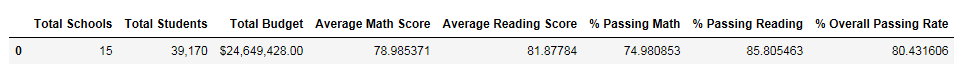
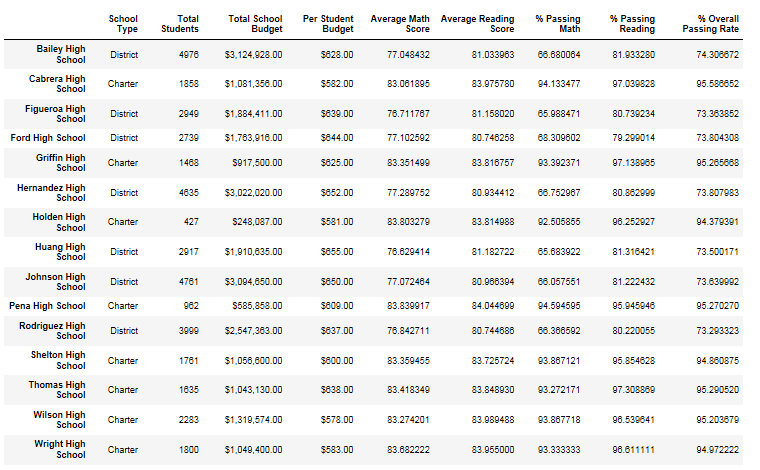
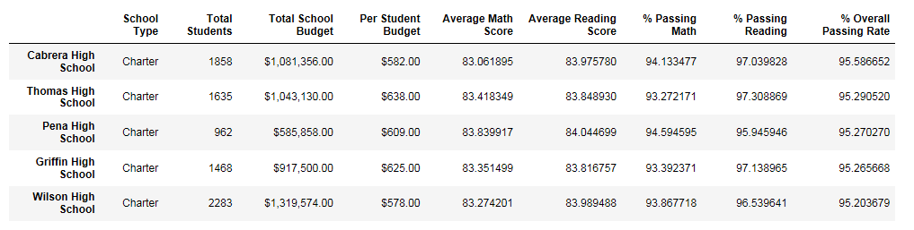
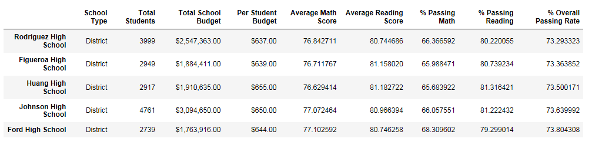
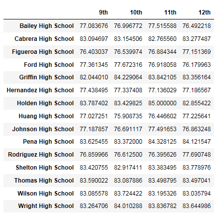
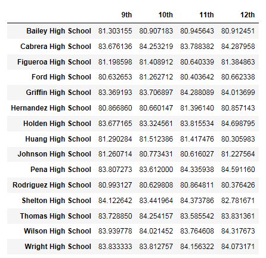
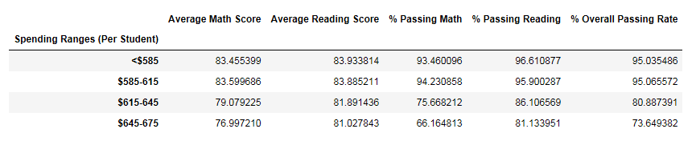
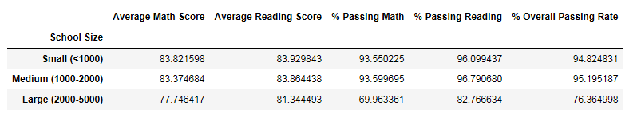
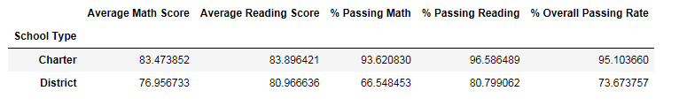

# Academy of Py Project Objectives
You've been asked to analyze the district-wide standardized test results. You'll be given access to every student's math and reading scores, as well as various information on the schools they attend. Your responsibility is to aggregate the data to and showcase obvious trends in school performance. You must include a written description of at least two observable trends based on the data.

# Files in this repo
- This Readme contains an Analysis of Results section with my written description of two observable trends based on the data, as well as screenshots of all of the required output tables.
- The screenshots folder contains the screenshots that I display in this Readme.
- The PyCitySchools folder contains my jupyter notebook "PyCitySchools.ipynb" and the 2 CSV files used for this analysis. Another folder ".ipynb_checkpoints" seems to have been created when I would periodically save my jupyter notebook while I worked on it, and I have left it in this PyCitySchools folder. 

# Analysis of Results
1. School Type and Math Scores

Looking at math scores overall for all schools, the average math score is 78.99 and the percentage of students with a passing score of 70 or greater is 74.98%. However, breaking down the data by school type (charter vs. district), it is revealed that the district schools perform much lower in math compared to charter schools. The average math score for district schools is 76.96, lower than the charter average of 83.47. The percentage of students with passing scores is 66.55% for district schools, much lower than the charter schools percentage of 93.62%. 

2. School size and Reading, Math, and Overall Scores

Large schools with 2000-5000 students perform at lower rates for math and reading compared to smaller schools. The average math score at large schools is 77.75, lower than the average of around 83 for smaller schools. The average reading score is similar for large and smaller schools, but the percentage of students with passing reading scores of 70 or greater is 82.77, much lower than the percentage of around 96% for smaller schools. The biggest difference is with the percentage of students that have passing math scores, with large schools having an average of 69.96% compared to around 93% for smaller schools. This results in the overall passing rate percentage being 76.36% for large schools, which is much lower than the overall passing rate of 94-95% for smaller schools.

# Screenshots of Output
District Summary

School Summary (all schools, unsorted)

Top Performing Schools (By Passing Rate)

Bottom Performing Schools (By Passing Rate)

Math Scores by Grade

Reading Scores by Grade

Scores by School Spending

Scores by School Size

Scores by School Type

